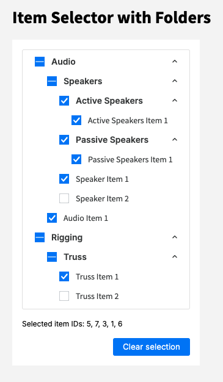

# Item Selector with Folders

This app was created using Angular v20.

I recommend NodeJS version 20+. I used v22.

### To get started, run:

```bash
npm install
npm run dev
```

This will run:

- the app at [`http://localhost:4200/`](http://localhost:4200/)
- the [json server](https://www.npmjs.com/package/json-server) at [`http://localhost:3000/`](http://localhost:3000/)

## Info

Hello :) Thanks for taking a look at my item selector with folders. This is my first ever Angular project (yay!) and it was really fun to put together. It took about 6-7 hours to complete as I was reading documentation every step of the way. During this time I also followed one of the tutorials on angular.dev (https://angular.dev/tutorials/first-app) which was a great resource, along with the rest of the docs.



This project was generated using [Angular CLI](https://github.com/angular/angular-cli) version 20.1.4.

## Running unit tests

To execute unit tests with the [Karma](https://karma-runner.github.io) test runner, use the following command:

```bash
ng test
```

## Notes

- I decided to use the latest version of Angular (v20) for this project. I weighed the pros and cons a bit first; I know that by using the new CLI there are some noticeable differences, for example:
  - No suffixes: instead of `equipment.service.ts` it's simply `equipment.ts`. for that reason I moved it to a services folder, for clarity.
  - I also know from reading the docs and referencing some older angular discussions online that some of the syntax I use is a bit different than with older versions. For example, `ngFor` vs `@for` though that changed a few versions ago. Still, wanted to make note.
- Instead of using `response.json` I created a `db.json` file to use json-server. I saw it in the angular tutorial and thought it was cool, so I went for it. :) This meant I had to modify the file by adding a `equipment` property, since the json server is a mock api. The rest of the data is the same as in the `response.json`.
- What could be expanded upon: better tests, a loading state when fetching data
- I normally don't add so many comments to my code but I decided to include them in case it helps
- This project taught me a ton of new Angular concepts, hopefully I didn't mess it all up haha. Thanks again for taking a look!
